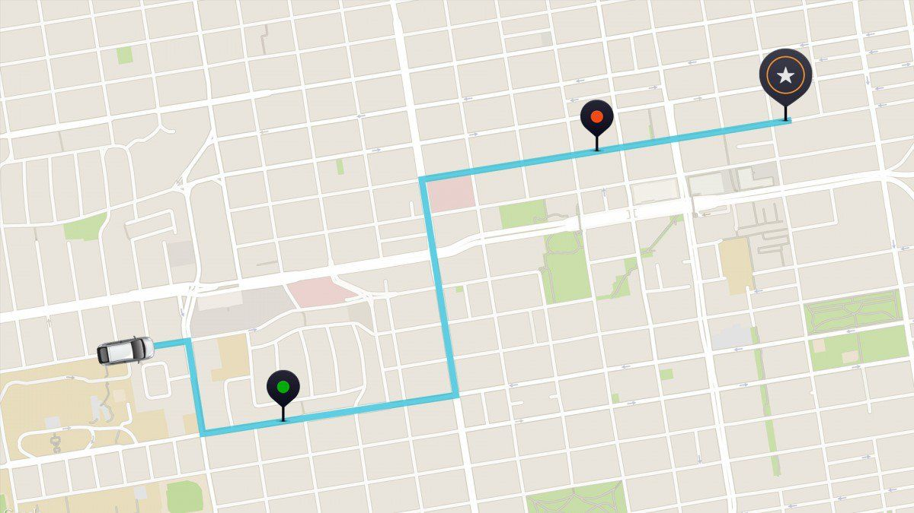
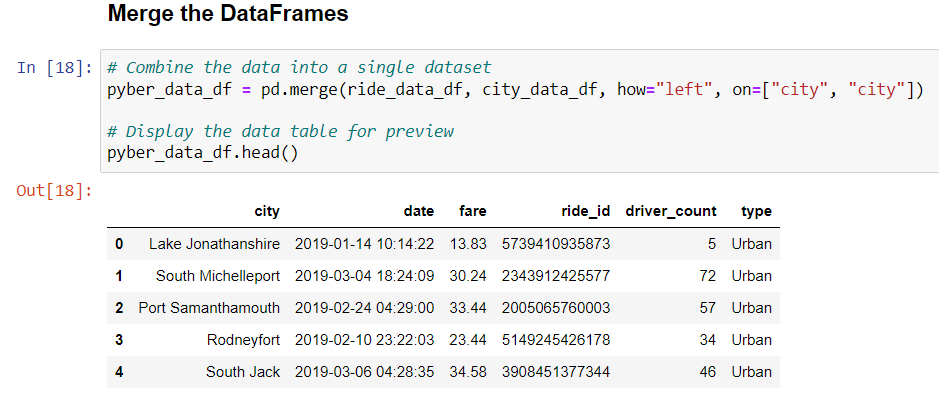
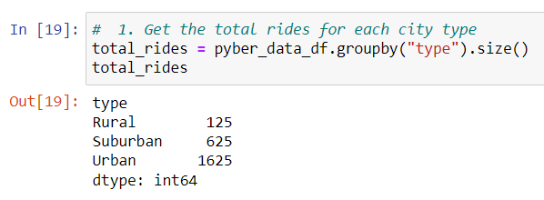
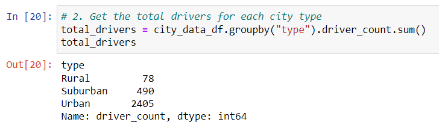
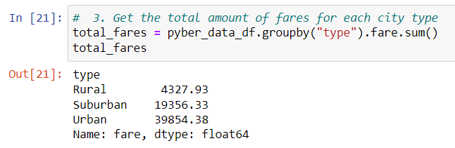
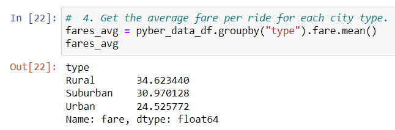
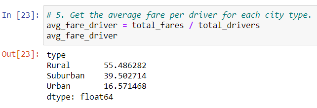
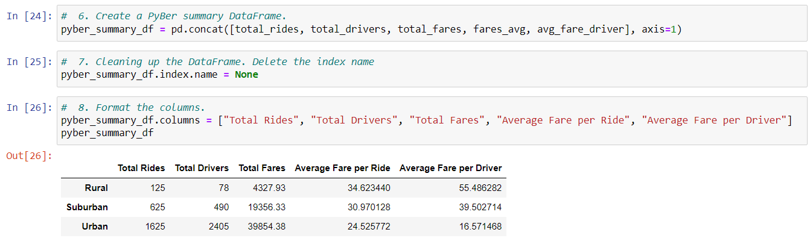
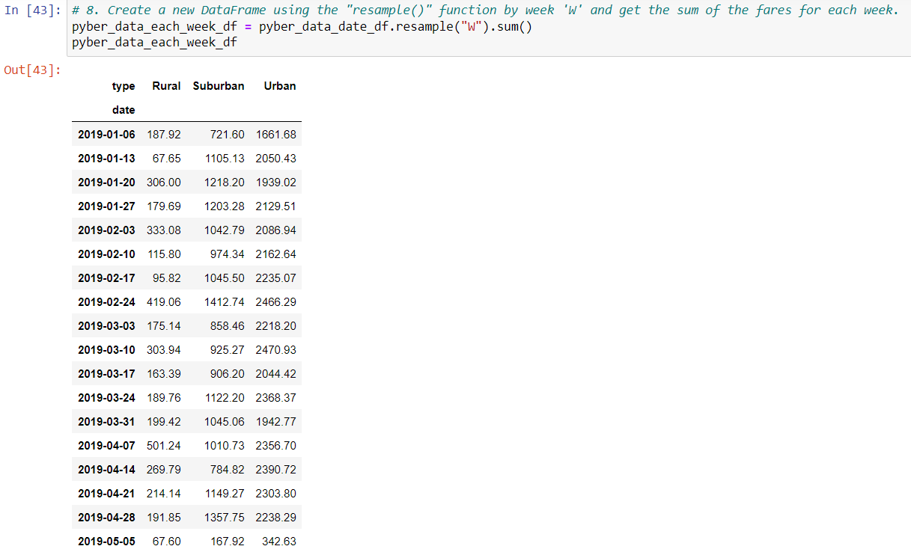
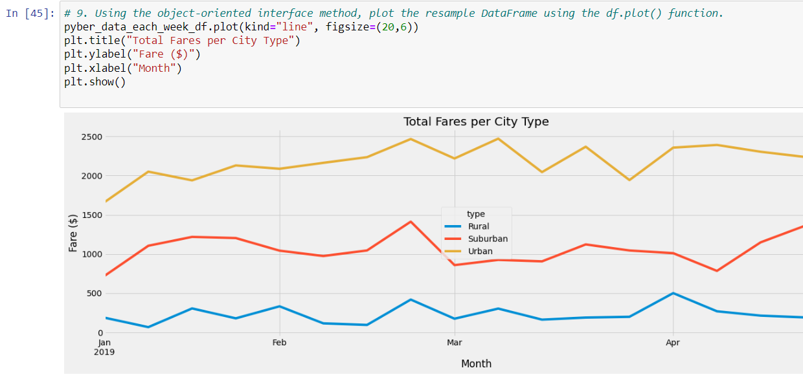

# week5_PyBer_Analysis

# Overview:

These days ride sharing companies have become more and more common. It seems like almost every time you’re out driving your car, you see another car with a sticker representing whichever company they’re driving for. Whether you’re in an urban, suburban, or rural area; they seem to be everywhere. How do these companies keep track of how much demand is in each area and how much money there is to be made? That’s exactly what my boss V. Isualize hopes to keep track of with her own ride sharing company called Pyber. With the use of Python and data visualizations, we can gain a better understanding of how this market works!

# Purpose:

My boss V. Isualize tasked me with doing a four-month analysis on all ride share data for Pyber between January to early May of 2019. I was given two data sets, the first is called city_data.csv which contains each city I’ll be analyzing, the number drivers, and whether the city is Urban, Suburban, or Rural. The second data set is called ride_data.csv, which includes the city of the ride, the date, the fare, and the driver. My first step was to combine these two datasets into one to more easily pull information for my analysis.

Now that we have our data in one spot, my next step was to find out how many rides Pyber had during these four months for each type of city. Knowing how many rides we do will give us a sense of how much demand there has been. 

Next, we want to find out how many drivers Pyber has in each city type. This will give us an idea of what the supply is like.

Our next main point of information is how much money are all these drivers bringing in? We’ll need to find the total fares for each area in order to do that.

Now that we have the total, let’s find the average fare per driver for each city type!

Having an average price per ride is useful information, however, let’s take this a step further and do average fare per driver. The price for a ride is dependent on supply and demand. That’s why finding the total number of rides and drivers is essential.

To tie all this information together, I created a dataframe. Now we can easily compare our data and see that the larger the city, the more drivers and total rides there are. We also see that there is a direct correlation between the number of drivers and the average fare. The more drivers there are, the less the average fare is. Rural areas are by far the hardest hit city type for how much it costs to get a ride with Pyber. Meanwhile, urban areas are the cheapest and easiest option.

My boss V. Isualize loved the work that I did, however, what she loves most is visualizations! She wants me to create a graph comparing all three city types in increments of a week at a time over the course of the four months. Using the resample() function, I was able to reorganize my data into weekly bins and then used the sum() function to get the total fares for each week. 

Final step was to create the graph!

# Recommendations:

Given the data that I have available to me, I would have to say that rural and suburban areas need more drivers. The price per ride increases when there are less drivers than there are rides given. Paying more than $30 (or even upwards of $50) for a ride is going to decrease consumer's incentive to ride with Pyber. Also in January, urban areas can probably have less drivers. January is a colder month and therefore a slower month for most businesses due to people staying in. We can also see that fares were consistently down that month. Urban areas (unlike suburban and rural areas) have a lower average fare per driver than average fare per ride. Which means there's so many drivers, it's decreasing the price per ride too much. Urban areas could probably get by with fewer drivers.